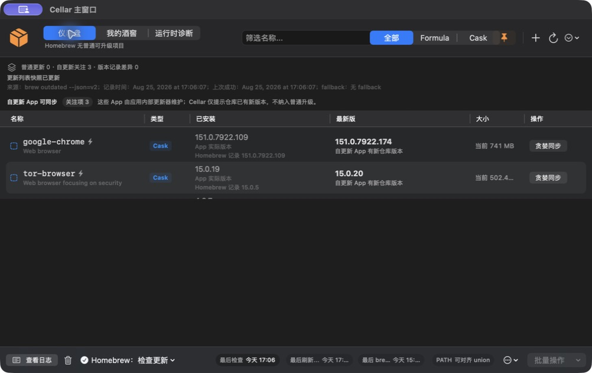
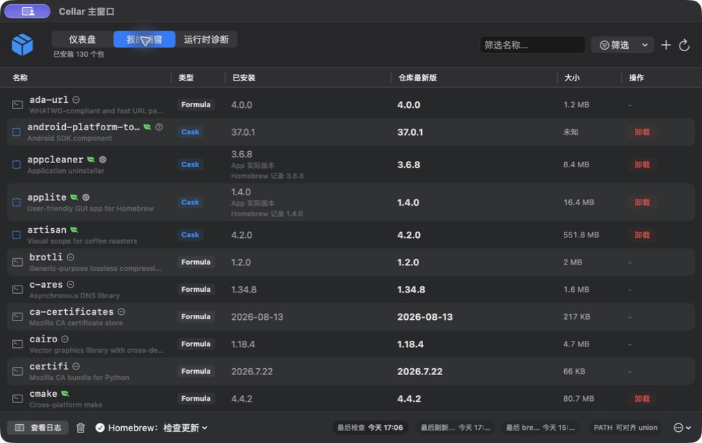

# Cellar


[](https://github.com/CAfeng11/Cellar/releases/latest)
[](https://github.com/CAfeng11/Cellar/actions/workflows/ci.yml)


Cellar 是一款原生 SwiftUI macOS 图形应用，通过菜单栏入口和完整主窗口管理 Homebrew 更新与 Node/Python 运行时秩序。

> A native SwiftUI macOS app for explainable Homebrew maintenance and local runtime diagnostics.

**这不是 CLI 应用。** Homebrew、npm、Python 与 shell 命令是 Cellar 的后端事实来源；日常检查、筛选、诊断和操作都在原生 GUI 中完成。

<p align="center">
  <a href="docs/images/cellar-demo.gif">
    
  </a>
</p>

<p align="center"><em>10 秒真实操作演示：仪表盘 → 我的酒窖 → Runtime Doctor。</em></p>

当前公开版本为 `2.2.2`。它延续 `2.2.1` 的产品边界，集中补强可靠性诊断、Runtime 全局工具定位、结构化状态表达和公开协作基础。

## 真实运行界面

以下静态画面直接截取自 Cellar `2.2.2` 在 macOS 上的真实运行状态，并非设计稿或终端输出。

<table>
  <tr>
    <td width="50%"><a href="docs/images/cellar-dashboard.jpeg"></a></td>
    <td width="50%"><a href="docs/images/cellar-library.jpeg"></a></td>
  </tr>
  <tr>
    <td align="center"><strong>仪表盘</strong><br>区分普通更新、自更新 Cask 与版本记录差异</td>
    <td align="center"><strong>我的酒窖</strong><br>筛选 Formula/Cask，查看版本、大小与可执行操作</td>
  </tr>
</table>

## 为什么做 Cellar

Homebrew、版本管理器、GUI App 和登录 Shell 往往各自都“能用”，但组合在一起后，用户很难回答几个简单问题：

- 今天到底有没有需要处理的更新？
- App 实际版本、Homebrew 记录和仓库版本为什么不同？
- 终端能找到 Node/Python，为什么 GUI App 找不到？
- 哪个 PATH 是当前事实，哪些修复会影响整个 GUI 会话？

Cellar 的目标不是再造包管理器，而是把这些状态整理成可观察、可解释、可回滚的本机维护流程。

## 核心能力

### Homebrew 维护

- 菜单栏显示普通可升级项目数量
- 快速读取 `brew outdated`，并按独立阈值执行 `brew update`
- 单项/批量升级、Formula Pin/Unpin、安装、卸载与清理
- 区分普通更新、自更新 Cask、仓库版本差异与 Homebrew receipt 差异
- 读取 Cask App bundle 实际版本，避免把 receipt 误称为当前 App 版本
- 代理、DNS、网络、端点、权限和 brew 缺失的结构化诊断
- 所有耗时操作可取消，并提供操作后复核摘要

### Runtime Doctor

- 同时观察 Node 与 Python
- 对比 GUI 环境和登录 Shell 的 PATH、解释器及包管理器入口
- 识别 Homebrew、nvm、fnm、Volta、pyenv、conda、pipx、uv 等来源
- 汇总全局工具的当前版本、latest、来源与检查时间
- 把过期、失败或缺少 latest 的结果标记为待复核，而不是伪装成实时结论
- 提供 Minimal Trusted PATH、观察模式、完整 Shell 镜像和专家策略
- 高风险操作默认只提供命令、影响范围与回滚说明

### 可解释状态

- 仪表盘先回答“是否需要处理”和“下一步是什么”
- “我的酒窖”解释已安装资产状态，不把所有版本差异都当成升级
- 事件中心记录关键操作结果；高级日志保留原始命令输出
- 可导出包含诊断快照、PATH Policy、可靠性问题和修复历史的报告

## 2.2.2 重点

- Runtime 全局工具关注项可定位到具体工具，不再只显示数量
- 超过 24 小时的 latest 结果会提示先复核
- Homebrew 命令超时可被识别为可靠性问题
- 批量操作与大小信息继续区分下载大小、当前安装体量和未知状态
- 补齐公开构建、测试、CI、安全和贡献说明

完整变更见 [CHANGELOG.md](CHANGELOG.md)。

## 产品边界

Cellar 不替代 Homebrew、npm、pip、uv、pyenv、conda、nvm、fnm 或 Volta。它负责发现、解释、对齐和提供克制的修复入口。

- 不静默改写 shell 配置
- 不持久化完整环境变量、代理凭据或 Runtime registry 凭据
- 不把 Runtime 全局工具混入 Homebrew 普通升级队列
- 不把当前安装体量冒充升级下载大小
- GUI PATH 写入必须显示影响范围和回滚命令

更详细的模块关系见 [架构说明](docs/ARCHITECTURE.md)，安全边界和漏洞报告方式见 [SECURITY.md](SECURITY.md)。

## 环境要求

- macOS 26 或更高版本
- Xcode 26 或更高版本
- Homebrew
  - Apple Silicon：`/opt/homebrew/bin/brew`
  - Intel：`/usr/local/bin/brew`

Runtime Doctor 会根据本机已有环境工作；不要求同时安装 Node 和 Python 的所有版本管理器。

## 构建与运行

克隆仓库后执行：

```bash
./script/build_and_run.sh
```

可选模式：

```bash
./script/build_and_run.sh --verify
./script/build_and_run.sh --logs
./script/build_and_run.sh --debug
```

也可以使用 Xcode 打开 `Cellar.xcodeproj`，选择共享的 `Cellar` scheme 后运行。

## 测试

```bash
./script/test.sh
```

等价的原始命令是：

```bash
xcodebuild test \
  -project Cellar.xcodeproj \
  -scheme Cellar \
  -configuration Debug \
  -destination "platform=macOS,arch=$(uname -m)" \
  -derivedDataPath /private/tmp/CellarTests \
  CODE_SIGNING_ALLOWED=NO
```

GitHub Actions 使用 `macos-26` runner 执行同一测试入口。

## 使用提示

- 普通刷新只读取可升级快照；“更新 Homebrew 仓库后检查”才会立即执行 `brew update`
- 自动维护开启后，快速刷新间隔和 `brew update` 阈值彼此独立
- Cellar 的更新提示主要显示在菜单栏、仪表盘和 Dock badge；当前不发送 macOS 系统通知
- 启用 Cellar 独立代理前，请先在设置中确认对应主机和端口可达
- 自更新 Cask 不进入普通批量升级；高级贪婪同步会再次说明覆盖安装风险

## 参与项目

Cellar 欢迎聚焦且可验证的贡献，特别是：

- Homebrew 行为兼容性与错误复盘
- macOS/SwiftUI 可访问性和菜单栏体验
- Node/Python/版本管理器识别准确性
- 测试、文档和可维护性改进

请先阅读 [CONTRIBUTING.md](CONTRIBUTING.md) 和 [CODE_OF_CONDUCT.md](CODE_OF_CONDUCT.md)。Bug 与功能建议请使用仓库的 Issue 模板。

## 项目状态

Cellar 目前由个人维护。源码可以构建和试用，但尚未承诺签名、notarization 或稳定的二进制发布节奏。路线规划见 [ROADMAP.md](ROADMAP.md)。

## License

[MIT License](LICENSE)
