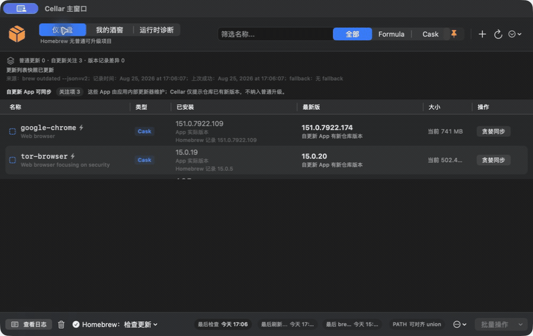

# Cellar for macOS

[English](README.md)

[](https://support.apple.com/zh-cn/macos)

[](https://github.com/CAfeng11/Cellar/releases/latest)
[](https://github.com/CAfeng11/Cellar/actions/workflows/ci.yml)


**用一款原生 macOS App，解释 Homebrew 更新混乱和 Node/Python PATH 冲突。**

Cellar 是一款原生 SwiftUI 菜单栏应用和完整窗口工作区。它不仅告诉你“有什么
需要处理”，还会解释终端与 GUI 环境为什么不一致、一次修复将改变什么，以及
如何验证和回滚。

<p align="center">
  <a href="docs/images/cellar-demo.gif">
    
  </a>
</p>

<p align="center"><em>10 秒真实操作：仪表盘 → 我的酒窖 → Runtime Doctor。</em></p>

## 下载

[**下载未签名的 2.2.3 测试版（Universal App）**](https://github.com/CAfeng11/Cellar/releases/download/v2.2.3-beta.1/Cellar-macOS-unsigned.zip)

需要 macOS 14 或更高版本，以及现有 Homebrew 安装。Release 是同时支持 Apple
Silicon 与 Intel Mac 的 Universal App。

> 此测试版尚未经过 Developer ID 签名和 Apple 公证，macOS 会提示它来自身份不明的
> 开发者。把 Cellar 移到“应用程序”后，按住 Control 点按 App，选择“打开”，再确认
> “打开”。请只从本仓库下载，并核对 Release 页面提供的 SHA-256 文件。

后续仍会提供签名和公证的稳定版。现在先提供未签名测试版，让没有安装 Xcode 的用户
也能实际体验 Cellar。

## 为什么需要 Cellar

Homebrew、版本管理器、GUI App 和登录 Shell 各自都可能“能用”，组合后却很难回答：

- 今天到底有没有值得处理的更新？
- App 实际版本、Homebrew receipt 和仓库版本为什么不同？
- 终端能找到 Node/Python，为什么 GUI App 找不到？
- 哪个 PATH 是当前事实，一次修复会影响哪里？

Cellar 不替代 Homebrew 或运行时版本管理器，而是把已有状态整理成可观察、可解释、
可验证和可回滚的本机维护流程。

## 与普通 Homebrew GUI 的区别

| | Cellar | 常见 Homebrew GUI |
|---|---|---|
| Homebrew 软件包维护 | 支持 | 支持 |
| App bundle / receipt / 仓库版本 | 分别解释 | 经常合并为一种更新状态 |
| GUI PATH / 登录 Shell PATH | 直接对比 | 通常不处理 |
| Node/Python 版本管理器诊断 | Runtime Doctor | 通常不处理 |
| 修复动作 | 显示范围、命令、验证和回滚 | 不一定 |
| 高风险环境变更 | 不静默执行 | 不一定 |

Cellar 面向希望使用 GUI、又不愿失去证据链的开发者和 Mac 高级用户。

## 核心能力

### Homebrew 维护

- 菜单栏显示普通可升级项目数量
- 快速读取 `brew outdated`，并按独立阈值执行 `brew update`
- 单项/批量升级、Formula Pin/Unpin、安装、卸载与清理
- 区分普通更新、自更新 Cask、仓库版本差异与 Homebrew receipt 差异
- 读取 Cask App bundle 实际版本，避免把 receipt 冒充当前 App 版本
- 代理、DNS、网络、端点、权限、超时和 brew 缺失的结构化诊断
- 耗时操作可取消，并提供操作后复核摘要

### Runtime Doctor

- 在同一工作区观察 Node 与 Python
- 对比 GUI 与登录 Shell 的 PATH、解释器和包管理器入口
- 识别 Homebrew、nvm、fnm、Volta、pyenv、conda、pipx、uv 等来源
- 汇总全局工具版本、latest 新鲜度、来源和检查时间
- 提供 Minimal Trusted PATH、Observe Only、完整 Shell 镜像和专家策略
- 高风险动作默认先显示命令、影响范围、验证和回滚方式

### 可解释状态

- 仪表盘先回答“是否需要处理”和“下一步是什么”
- “我的酒窖”解释资产状态，不把所有版本差异都称为升级
- 事件中心记录关键结果，高级日志保留原始命令输出
- 可导出诊断快照、PATH Policy、可靠性问题和修复历史

## 安全与隐私

- 不静默改写 shell 配置
- 不持久化完整环境变量、代理凭据或 registry 凭据
- 不把 Runtime 全局工具混入 Homebrew 普通升级队列
- 不把当前安装体量冒充下载大小
- GUI PATH 写入前显示影响范围和回滚命令

更多信息见[架构说明](docs/ARCHITECTURE.md)和[安全策略](SECURITY.md)。

## 从源码构建

源码构建需要 macOS 14+、Xcode 26+ 和 Homebrew。

```bash
git clone https://github.com/CAfeng11/Cellar.git
cd Cellar
./script/build_and_run.sh
```

可选模式：

```bash
./script/build_and_run.sh --verify
./script/build_and_run.sh --logs
./script/build_and_run.sh --debug
```

也可以用 Xcode 打开 `Cellar.xcodeproj`，运行共享的 `Cellar` scheme。

## 测试

```bash
./script/test.sh
```

CI 使用同一测试入口。签名、notarization 和发布流程见
[发布 Cellar](docs/RELEASING.md)。

## 参与项目

项目欢迎聚焦且可验证的贡献，尤其是 Homebrew 行为兼容性、SwiftUI 可访问性、
菜单栏体验、运行时识别、测试和文档改进。

提交前请阅读 [CONTRIBUTING.md](CONTRIBUTING.md) 和
[CODE_OF_CONDUCT.md](CODE_OF_CONDUCT.md)。Bug 与功能建议请使用 Issue 模板。

Cellar 目前由个人维护。方向见 [ROADMAP.md](ROADMAP.md)，可见变更见
[CHANGELOG.md](CHANGELOG.md)。

## License

[MIT License](LICENSE)
